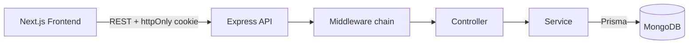

# Doctor Tracker: Backend API

REST API for **Doctor Tracker**, a secure admin portal to manage doctors and their patients, with dashboard analytics. Built with Node.js, Express, TypeScript, Prisma and MongoDB.

- Frontend repository: `https://github.com/monirhabderabby/doctor-tracker-website`
- Live frontend: `https://careguide.monirhrabby.com`
- Live API: `https://careguideapi.monirhrabby.com/api` (health check: `<API_BASE_URL>/api/health`)

---

## Description

Doctor Tracker gives clinic administrators one place to manage doctors and patients. An authenticated admin can create and search doctors, assign patients to them, review every patient from a dedicated page, and read live analytics such as patients per doctor, growth over time and condition distribution. The API is fully protected: only a logged-in admin can reach any data route, every input is validated, and list endpoints support search, filtering, sorting and pagination so the UI stays fast as data grows.

---

## Tech Stack

| Area | Choice |
|---|---|
| Runtime / Framework | Node.js, Express 5 |
| Language | TypeScript |
| Database | MongoDB (Atlas) |
| ORM | Prisma 6 (`@prisma/client`) |
| Validation | Zod |
| Auth | JWT in an httpOnly cookie, bcrypt password hashing |
| Security | helmet, CORS (credentials), express-rate-limit |
| Logging | morgan |

---

## Setup Guide

### Prerequisites

- Node.js 20 or newer and npm
- A MongoDB database that runs as a **replica set**. A free MongoDB Atlas cluster works out of the box. A standalone local `mongod` does not, because Prisma needs a replica set for MongoDB.

### Steps

```bash
# 1. Clone and enter the backend folder
git clone <BACKEND_REPO_URL>
cd <backend-folder>

# 2. Install dependencies
npm install

# 3. Create your env file and fill in the values
cp .env.example .env

# 4. Generate the Prisma client and create collections and indexes
npm run db:generate
npm run db:push

# 5. Create the admin user (uses ADMIN_EMAIL and ADMIN_PASSWORD from .env)
npm run seed

# 6. Start the dev server
npm run dev
```

The API runs on `http://localhost:5000`. Verify it with `GET http://localhost:5000/api/health`, which returns `{ "status": "ok" }`.

### Environment variables

A ready-to-copy template is in [`.env.example`](./.env.example).

| Variable | Description |
|---|---|
| `PORT` | Server port (default `5000`) |
| `NODE_ENV` | `development` or `production` |
| `DATABASE_URL` | MongoDB connection string, including the database name |
| `JWT_SECRET` | Secret used to sign tokens, at least 16 characters |
| `JWT_EXPIRES_IN` | Token lifetime (default `7d`) |
| `CLIENT_URL` | Exact frontend origin allowed by CORS, no trailing slash |
| `ADMIN_EMAIL` | Email of the admin created by `npm run seed` |
| `ADMIN_PASSWORD` | Password of that admin, at least 8 characters |

The server validates these at startup and exits with a clear message if any are missing or invalid.

### Scripts

| Script | Purpose |
|---|---|
| `npm run dev` | Start the dev server with auto-reload |
| `npm run build` | Generate the Prisma client and compile TypeScript to `dist/` |
| `npm start` | Run the compiled server from `dist/` |
| `npm run db:push` | Sync the Prisma schema and indexes to MongoDB |
| `npm run db:generate` | Generate the Prisma client |
| `npm run seed` | Create or update the admin user |

### Demo credentials

```
Email:    <ADMIN_EMAIL>
Password: <ADMIN_PASSWORD>
```

---

## System Architecture

The Next.js frontend talks to this Express API over REST. The browser never sees the token: it lives in an httpOnly cookie that the API sets on login and the browser sends back on every request.



### Request lifecycle

1. **Global middleware**: `helmet`, CORS (credentials enabled for `CLIENT_URL`), JSON body parser, cookie parser, request logger.
2. **Rate limit**: applied to `POST /api/auth/login` (10 attempts per 15 minutes).
3. **`authGuard`**: verifies the JWT from the `token` cookie. Applied to every `/api/doctors`, `/api/patients` and `/api/dashboard` route.
4. **`validate`**: Zod schemas for `body`, `params` and `query`. Invalid input returns `400` with field-level errors.
5. **Controller**: reads the validated request and shapes the HTTP response.
6. **Service**: business rules and all Prisma queries.
7. **Central error handler**: maps Zod, Prisma and custom `ApiError` errors to consistent JSON responses.

### Folder structure

```
backend/
├── prisma/
│   ├── schema.prisma        # Admin, Doctor, Patient models and indexes
│   └── seed.ts              # Creates the admin user
└── src/
    ├── config/              # env validation, Prisma client
    ├── middlewares/         # auth, validate, errorHandler, notFound
    ├── modules/
    │   ├── auth/
    │   ├── doctors/
    │   ├── doctor-patients/ # nested: /doctors/:id/patients
    │   ├── patients/
    │   └── dashboard/
    ├── utils/               # ApiError, jwt, pagination, validators, date
    ├── routes.ts            # mounts all modules under /api
    ├── app.ts               # Express app and middleware setup
    └── server.ts            # DB connect and listen
```

Each module follows the same pattern: `*.routes.ts`, `*.controller.ts`, `*.service.ts`, `*.schema.ts`.

### Data model

- **Admin**: `name`, `email` (unique), `password` (bcrypt hash)
- **Doctor**: `name`, `specialization`, `hospital`, `phone`, `email` (unique), timestamps
- **Patient**: `name`, `age`, `gender` (`MALE | FEMALE | OTHER`), `phone`, `condition`, `doctorId`, timestamps

A doctor has many patients. Deleting a doctor deletes its patients (`onDelete: Cascade`).

---

## API Reference

All routes are prefixed with `/api`. Except `POST /auth/login`, every route requires the auth cookie.

### Auth

| Method | Endpoint | Description |
|---|---|---|
| POST | `/auth/login` | Log in, sets the httpOnly `token` cookie |
| POST | `/auth/logout` | Clears the cookie |
| GET | `/auth/me` | Current admin (used for session tracking) |

### Doctors

| Method | Endpoint | Description |
|---|---|---|
| POST | `/doctors` | Create a doctor |
| GET | `/doctors` | List with `page`, `limit`, `search`, `specialization`, `hospital`, `from`, `to`, `sort` |
| GET | `/doctors/:id` | Doctor details with `patientCount` |
| PATCH | `/doctors/:id` | Update a doctor |
| DELETE | `/doctors/:id` | Delete a doctor and its patients |

### Doctor's patients

| Method | Endpoint | Description |
|---|---|---|
| GET | `/doctors/:id/patients` | Patients of one doctor, with `page`, `limit`, `search`, `condition`, `from`, `to`, `sort` |
| POST | `/doctors/:id/patients` | Add a patient under this doctor |
| DELETE | `/doctors/:id/patients/:patientId` | Remove a patient from this doctor |

### Patients

| Method | Endpoint | Description |
|---|---|---|
| POST | `/patients` | Create a patient (`doctorId` in the body) |
| GET | `/patients` | List with the filters above plus `doctorId`; each item includes basic doctor info |
| GET | `/patients/:id` | Patient details |
| PATCH | `/patients/:id` | Update, including reassigning to another doctor |
| DELETE | `/patients/:id` | Delete a patient |

### Dashboard

| Method | Endpoint | Description |
|---|---|---|
| GET | `/dashboard/summary` | Totals, last 7 days growth, average patients per doctor |
| GET | `/dashboard/patients-per-doctor?limit=10` | Top doctors by patient count |
| GET | `/dashboard/timeline?range=7d\|30d\|12m` | Doctors and patients added over time, empty buckets filled with 0 |
| GET | `/dashboard/conditions` | Condition distribution, top 8 plus an `Others` slice |

### Response formats

```jsonc
// Success (single item)
{ "success": true, "data": { } }

// Success (list)
{ "success": true, "data": [ ], "meta": { "page": 1, "limit": 10, "total": 42, "totalPages": 5 } }

// Error
{ "success": false, "message": "Validation failed", "errors": [{ "path": "email", "message": "Invalid email" }] }
```

Common status codes: `400` validation, `401` unauthenticated, `404` not found, `409` duplicate value (for example a doctor email), `429` too many login attempts.

---

## Technical Decisions

### 1. Custom JWT in an httpOnly cookie instead of an auth library or localStorage

**Context.** The spec asks for secure login and a portal where only authenticated users can reach any data. The frontend (Next.js) and the API (Express) are separate services, and there is only one login flow with no self-registration.

**Decision.** The API signs a JWT on login and sends it as an `httpOnly` cookie (`secure` and `sameSite` set per environment). Passwords are hashed with bcrypt, login is rate limited, and the frontend tracks the session through `GET /auth/me`. The admin is created by a seed script, so there is no public sign-up endpoint to attack.

**Why.**
- An httpOnly cookie cannot be read by JavaScript, so an XSS bug cannot steal the token. A token in `localStorage` can be stolen that way.
- One service owns authentication. Putting an auth library inside Next.js while Express also has to verify sessions would split the auth logic across two places.
- Libraries like Better Auth or NextAuth add OAuth, 2FA and sign-up flows that this portal does not need, and they bring their own session collections next to the `Admin` model.

**Trade-offs.**
- Stateless JWTs cannot be revoked before they expire. Logout clears the cookie, and the 7 day lifetime is configurable. A server-side session store would add revocation at the cost of an extra lookup on every request.
- Cookies need care across domains. When the frontend and API live on different domains in production, the cookie requires `SameSite=None; Secure` and a matching CORS origin. The app sets `trust proxy` so secure cookies and rate limiting work behind Nginx or a hosting proxy.
- The Next.js route guard can only check that the cookie exists. Real validation always happens in the API through `authGuard`.

### 2. Prisma on MongoDB, with aggregation pipelines for analytics and indexed queries for lists

**Context.** The team already uses Prisma, and the spec emphasises query performance and dashboard analytics over doctors and patients.

**Decision.** Standard CRUD, filtering and pagination go through Prisma Client for type safety. Analytics that Prisma cannot express cleanly (date bucketing and case-insensitive condition grouping) use MongoDB aggregation pipelines through `aggregateRaw`. Indexes are declared in the schema: `createdAt`, `specialization`, `hospital` and `name` on doctors, and `[doctorId, createdAt]`, `condition`, `createdAt` and `name` on patients.

**Why.**
- Lists run `findMany` and `count` in parallel, with `skip` and `take`, and an `id` tiebreaker so page order stays stable.
- `patientCount` comes from Prisma's `_count`, so the doctors list needs no extra request per row.
- The timeline groups by day or month in the `Asia/Dhaka` timezone inside MongoDB, then fills empty buckets with zero on the server so charts have no gaps.
- Patients per doctor uses `groupBy` with a top-N limit, and the doctor details are fetched in one follow-up query instead of one per row.

**Trade-offs.**
- Prisma needs a replica set for MongoDB, so a standalone local `mongod` does not work. Atlas does.
- There are no migrations: `prisma db push` syncs the schema and indexes.
- MongoDB has no foreign keys. The API checks that a doctor exists before creating or reassigning a patient, to avoid orphan records, and cascade delete is emulated by Prisma.
- Text search uses case-insensitive `contains`, which MongoDB runs as a regex and which cannot use a normal index efficiently. It is fine at this scale. For large datasets the next step is a MongoDB text or Atlas Search index.

---

## Visual Evidence

This repository is the API, so its evidence is the API in action. Desktop and mobile screenshots of the UI are in the frontend repository: `<FRONTEND_REPO_URL>`.

| Screenshot | Preview |
|---|---|
| Login and authenticated `/auth/me` response | `` |
| Doctors list with search, filter and pagination | `` |
| Dashboard analytics responses | `` |

A Postman collection with every endpoint is included at `./docs/postman_collection.json`.

---

## Deployment Notes

- Set `NODE_ENV=production`, a strong `JWT_SECRET`, the real `CLIENT_URL` and the production `DATABASE_URL`.
- Build and start with `npm run build` and `npm start`.
- Run `npm run db:push` and `npm run seed` once against the production database.
- Behind Nginx or any proxy, forward the original protocol so secure cookies work.
